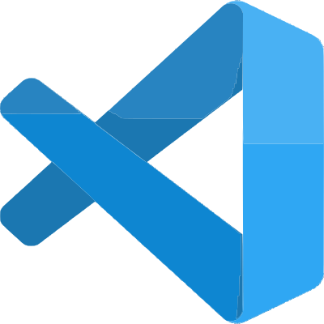
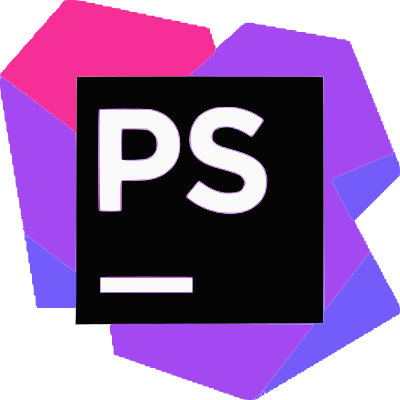

<h1 align="center"> Hey 👋 , I'm Simon </h1>

<h3 align="center">Fullstack web developer from France</h3>
<h3 align="center">Engineering in Computer Science @Epsi (To be graduated in 2021)</h3>

 

<h3> 🕵🏻‍♂️ Some facts  about me </h3>

- ⛴ I’m currently working on the **[Trade Easy](https://www.trade-easy.fr)** project [@Pepperbay](https://pepperbay.fr) with Symfony, ReactJs and PostgreSQL !
- 🌱   I’m always learning things about Full Stack Development.
- 🔍 I’m looking to collaborate on Web Development Projects.
- 👀 Curious about computer science and customer needs.

<h3>⚡ Other facts about me : </h3>

  - 🎧 Music lover since ever, 🎸 learning guitar on my free time.
  - 🎬  Movie lover. One of my favorite movies :  
[The Shawshank Redemption](https://www.imdb.com/title/tt0111161/)
  - 🎮 Board games and video games player .

## 📚 Languages and Tools: 🛠

<table align="center">
  <tr align="center">
    <td width="60%"><b>Languages<b></td>
    <td width="60%"><b>Tools<b></td>
  </tr>
  <tr align="center">
    <td width="60%">
      
      
      
      
      
      
      
    </td>
    <td width="60%">
      
      
      
      
      
    </td>
  </tr>
</table>

 

## 🖥 Desktop environnment: 🛠
<table align="center">
  <tr align="center">
    <td width="60%"><b>Tools<b></td>
    <td width="60%"><b>Distribution<b></td>
  </tr>
  <tr align="center">
    <td width="60%">
      
      
       
      
    </td>
    <td width="60%">
      
      
      
    </td>
  </tr>
</table>

 
 

	 

⭐️ From [Simon Huet](https://github.com/SimonHuet) 
